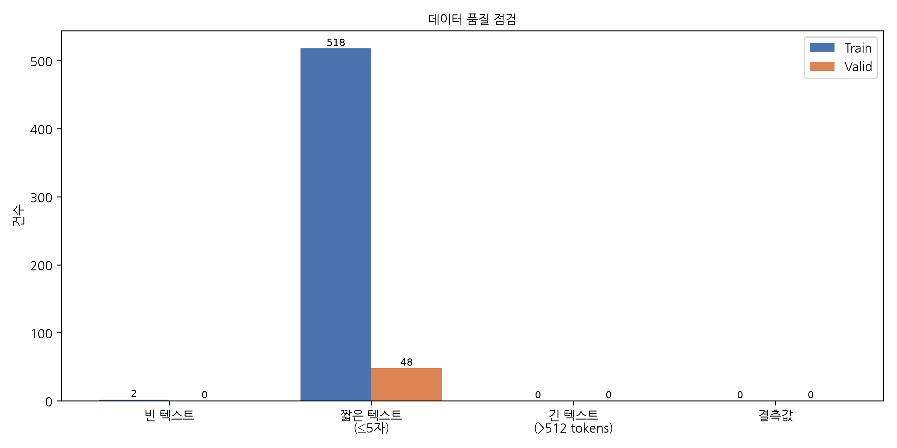

# 데이터 전처리 결과 보고서

> 작성일: 2026-06-20 03:04

---

## 1. 데이터 로드

| 항목 | 값 |
|---|---|
| 데이터 경로 | `../output/analysis_dataset.json` |
| 토크나이저 | `klue/bert-base` |

---

## 2. 전체 데이터 수

### 원본 (중복 제거 전)

| 구분 | 건수 |
|---|---|
| 전체 | 98,177 |
| Train | 87,265 |
| Valid | 10,912 |
| 라벨 수 | 2 |

---

## 3. 라벨 별 데이터 수

### Train — Before / After 중복 제거 비교

| 라벨 | Before (건 / 비율) | After (건 / 비율) | 변화량 |
|---|---|---|---|
| churn_signal | 7,025 (8.05%) | 5,497 (9.59%) | -1,528 |
| retain | 80,240 (91.95%) | 51,804 (90.41%) | -28,436 |

### Valid — Before / After 중복 제거 비교

| 라벨 | Before (건 / 비율) | After (건 / 비율) | 변화량 |
|---|---|---|---|
| churn_signal | 970 (8.89%) | 587 (10.63%) | -383 |
| retain | 9,942 (91.11%) | 4,934 (89.37%) | -5,008 |

---

## 4. 중복 데이터 수 (label & text 기준)

| 중복 유형 | 건수 |
|---|---|
| Train 내부 중복 | 29,964 |
| Valid 내부 중복 | 2,214 |
| Train ↔ Valid 교차 중복 | 3,177 |
| **전체 합산** | **35,355** |

> **교차 중복(Cross-split Duplicate)**: `raw_df` 전체 기준 중복 건수(35,355)와 각 split 내부 중복 합산이 다른 이유는,
> Train과 Valid **양쪽에 동일한 `(label, text)` 쌍이 존재**하는 경우가 3,177건 있기 때문입니다.
> 이는 **데이터 누수(Data Leakage)** 가능성이 있으므로 Valid를 우선 보존하고 Train에서 해당 데이터를 제거합니다.

### 저장된 중복 데이터 CSV

| 파일 | 설명 |
|---|---|
| `duplicate_train.csv` | Train 내부 중복 행 전체 |
| `duplicate_valid.csv` | Valid 내부 중복 행 전체 |
| `duplicate_cross.csv` | Train ↔ Valid 교차 중복 행 전체 |

---

## 5. 중복 제거 후 데이터 수

> 제거 순서: ① 각 split 내부 중복 제거 → ② Train ↔ Valid 교차 중복 제거 (Valid 우선 보존)

| 구분 | 건수 | 비고 |
|---|---|---|
| Train | 57,301 | 교차 중복 3,177건 추가 제거 |
| Valid | 5,521 | — |
| **전체** | **62,822** | — |

---

## 6. 문장 길이 (Character 기준)

| 구분 | mean | median | std | min | max | p90 | p95 | p99 |
|---|---|---|---|---|---|---|---|---|
| Train | 24.74 | 21.0 | 15.49 | 0 | 356 | 44.0 | 54.0 | 80.0 |
| Valid | 24.98 | 20.0 | 16.24 | 3 | 243 | 45.0 | 56.0 | 83.0 |

---

## 7. 토크나이징 후 토큰 수

| 구분 | mean | median | std | min | max | p90 | p95 | p99 |
|---|---|---|---|---|---|---|---|---|
| Train | 13.93 | 12.0 | 8.27 | 0 | 176 | 24.0 | 29.0 | 43.0 |
| Valid | 13.97 | 12.0 | 8.71 | 1 | 130 | 25.0 | 31.0 | 45.0 |

---

## 8. Vocab 정보

| 항목 | 값 |
|---|---|
| Tokenizer | `klue/bert-base` |
| Class | `BertTokenizer` |
| Vocabulary Size | 32,000 |

---

## 9. 데이터 품질 점검

| 항목 | 기준 | Train | Valid |
|---|---|---|---|
| 빈 텍스트 | `text == ""` | 2 | 0 |
| 짧은 텍스트 | `char ≤ 5` | 518 | 48 |
| 긴 텍스트 | `token > 512` | 0 | 0 |
| 결측값 | `text is null` | 0 | 0 |

### 저장된 빈 텍스트 CSV

| 파일 | 설명 |
|---|---|
| `empty_text_train.csv` | Train 빈 텍스트 행 전체 (2건) |
| `empty_text_valid.csv` | Valid 빈 텍스트 행 전체 (0건) |

---

## 10. 모델 입력 사양

### 공통 Tokenizer
- KLUE SentencePiece (`klue/bert-base`)

### 사용 모델

| # | 모델 |
|---|---|
| 1 | LSTM |
| 2 | Text CNN |
| 3 | Transformer Encoder (Scratch) |
| 4 | KLUE-BERT Fine-tuning |

---

## 11. 생성 산출물

### 보고서
- `preprocessing_report.md`

### 시각화
- `label_distribution.png` — Train / Valid 라벨 분포 (중복 제거 전)
- `char_length_distribution.png` — Train / Valid 문장 길이 분포
- `token_length_distribution.png` — Train / Valid 토큰 수 분포
- `data_quality_report.png` — 데이터 품질 점검 결과

### 중복 데이터 CSV
- `duplicate_train.csv` — Train 내부 중복 행
- `duplicate_valid.csv` — Valid 내부 중복 행
- `duplicate_cross.csv` — Train ↔ Valid 교차 중복 행

### 빈 텍스트 CSV
- `empty_text_train.csv` — Train 빈 텍스트 행
- `empty_text_valid.csv` — Valid 빈 텍스트 행

### 분석 결과
- `analysis_result.json`
