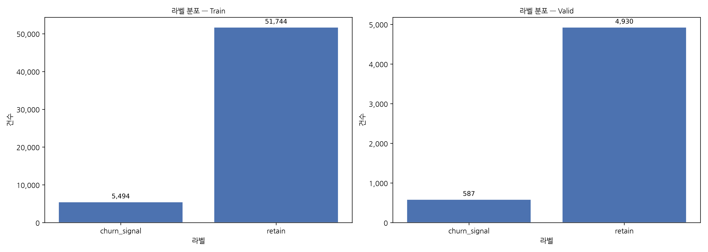
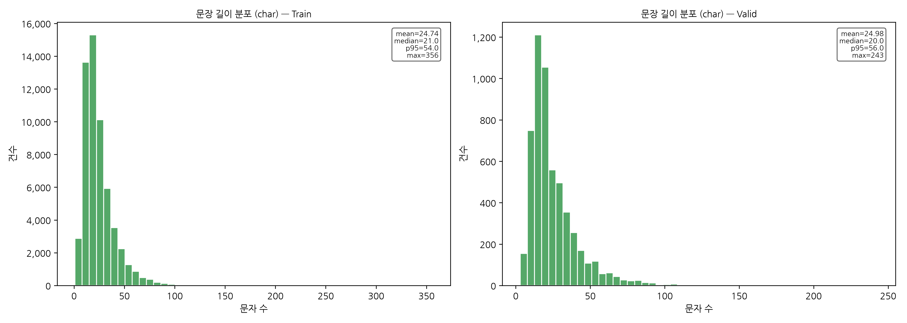
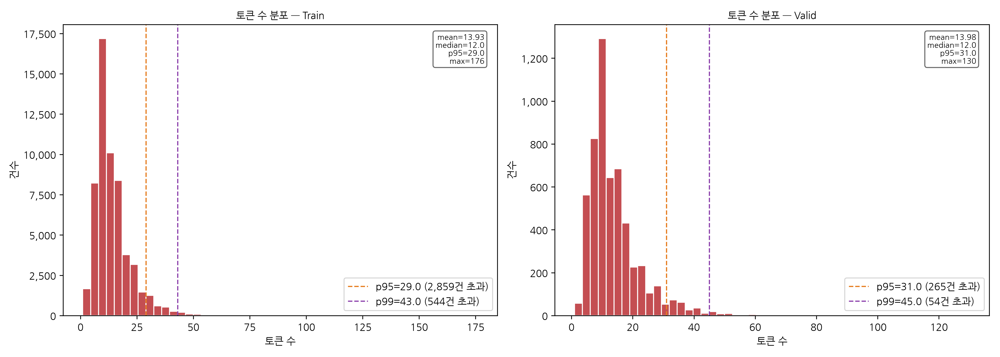

# 데이터 전처리 결과 보고서

> 작성일: 2026-06-20 23:35

---

## 1. 데이터 로드 및 텍스트 정제

| 항목 | 값 |
|---|---|
| 데이터 경로 | `../output/analysis_dataset.json` |
| 토크나이저 | `klue/bert-base` |

### 1-1. 데이터 확인 (정제 전)

| 항목 | 값 |
|---|---|
| 로드 건수 | 98,177 |
| 결측값 (text) | 0건 |
| 빈 텍스트 | 58건 |

### 1-2. 텍스트 정제

| 단계 | 처리 내용 | 처리 건수 |
|---|---|---|
| ① None → `""` | text가 None인 행을 빈 문자열로 변환 | 0건 |
| ② 앞뒤 공백 제거 | `str.strip()` 적용 | 전체 적용 |
| ③ 빈 텍스트 제거 | `text == ""` 행 drop → `empty_text_removed.csv` 저장 | 58건 |
| **정제 후 전체** | | **98,119건** |

---

## 2. 전체 데이터 수 (텍스트 정제 후)

| 구분 | 건수 |
|---|---|
| 전체 | 98,119 |
| Train | 87,209 |
| Valid | 10,910 |
| 라벨 수 | 2 |

---

## 3. 중복 데이터 수 (label & text 기준)

| 중복 유형 | 건수 |
|---|---|
| Train 내부 중복 | 29,971 |
| Valid 내부 중복 | 2,216 |
| Train ↔ Valid 교차 중복 | 3,177 |
| **전체 합산** | **35,364** |

> **교차 중복(Cross-split Duplicate)**: Train과 Valid 양쪽에 동일한 `(label, text)` 쌍이 존재하는 경우로,
> **데이터 누수(Data Leakage)** 방지를 위해 Valid를 우선 보존하고 Train에서 제거합니다.

### 저장된 중복 데이터 CSV

| 파일 | 설명 |
|---|---|
| `../output/duplicate_train.csv` | Train 내부 중복 행 전체 |
| `../output/duplicate_valid.csv` | Valid 내부 중복 행 전체 |
| `../output/duplicate_cross.csv` | Train ↔ Valid 교차 중복 행 전체 |

---

## 4. 중복 제거 후 데이터 수

> 제거 순서: ① 각 split 내부 중복 → ② Train ↔ Valid 교차 중복 (Valid 우선 보존)

| 구분 | 건수 | 비고 |
|---|---|---|
| Train | 57,238 | 교차 중복 3,177건 추가 제거 |
| Valid | 5,517 | — |
| **전체** | **62,755** | — |

---

## 5. 라벨 별 데이터 수 (중복 제거 전 → 후 비교)

### Train

| 라벨 | Before (건 / 비율) | After (건 / 비율) | 변화량 |
|---|---|---|---|
| churn_signal | 7,025 (8.06%) | 5,494 (9.6%) | -1,531 |
| retain | 80,184 (91.94%) | 51,744 (90.4%) | -28,440 |

### Valid

| 라벨 | Before (건 / 비율) | After (건 / 비율) | 변화량 |
|---|---|---|---|
| churn_signal | 970 (8.89%) | 587 (10.64%) | -383 |
| retain | 9,940 (91.11%) | 4,930 (89.36%) | -5,010 |

---

## 6. 문장 길이 (Character 기준)

| 구분 | mean | median | std | min | max | p90 | p95 | p99 |
|---|---|---|---|---|---|---|---|---|
| Train | 24.74 | 21.0 | 15.49 | 1 | 356 | 44.0 | 54.0 | 80.0 |
| Valid | 24.98 | 20.0 | 16.24 | 3 | 243 | 45.0 | 56.0 | 83.0 |

---

## 7. 토크나이징 후 토큰 수

| 구분 | mean | median | std | min | max | p90 | p95 | p99 |
|---|---|---|---|---|---|---|---|---|
| Train | 13.93 | 12.0 | 8.27 | 1 | 176 | 24.0 | 29.0 (2,859건 초과) | 43.0 (544건 초과) |
| Valid | 13.98 | 12.0 | 8.71 | 1 | 130 | 25.0 | 31.0 (265건 초과) | 45.0 (54건 초과) |

> p95 / p99 기준선은 히스토그램에 수직선으로 표시됩니다.

---

## 8. Vocab 정보

| 항목 | 값 |
|---|---|
| Tokenizer | `klue/bert-base` |
| Class | `BertTokenizer` |
| Vocabulary Size | 32,000 |

---

## 10. 모델 입력 사양

### 공통 Tokenizer
- KLUE SentencePiece (`klue/bert-base`)

### 사용 모델

| # | 모델 |
|---|---|
| 1 | LSTM |
| 2 | Text CNN |
| 3 | Transformer Encoder (Scratch) |
| 4 | KLUE-BERT Fine-tuning |

---

## 11. 생성 산출물

### 보고서
- `preprocessing_report.md`

### 시각화
- `label_distribution.png` — 라벨 분포 (중복 제거 후)
- `char_length_distribution.png` — 문장 길이 분포
- `token_length_distribution.png` — 토큰 수 분포 (p95/p99 기준선 포함)

### 중복 데이터 CSV
- `duplicate_train.csv` — Train 내부 중복 행
- `duplicate_valid.csv` — Valid 내부 중복 행
- `duplicate_cross.csv` — Train ↔ Valid 교차 중복 행

### 빈 텍스트 CSV
- `../output/empty_text_removed.csv` — 정제 단계에서 제거된 빈 텍스트 행

### 최종 학습용 데이터셋
- `../output/clean_train.csv`
- `../output/clean_valid.csv`

### 분석 결과
- `analysis_result.json`
